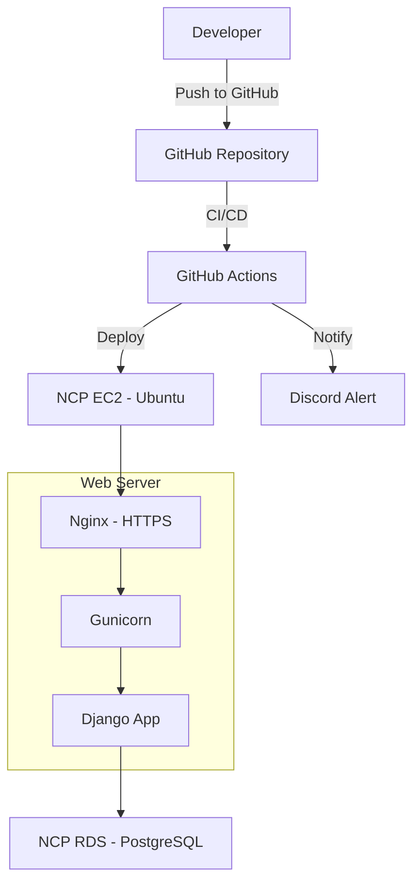

# 🧠 Focuz Backend: 당신의 수면, 퍼포먼스가 되다  

서비스 주소

🔗 https://focusz.site

🔗 https://www.focusz.site

🔗 https://www.dev.focusz.site (개발자용)

수면과 인지 기능의 상관관계를 지원하는 API 서버
---

## 🎯 프로젝트 소개  
**Focuz Backend**는 모바일 앱 사용자의 수면 데이터와 인지 기능 테스트 데이터를 수집하고, 분석 및 시각화 API를 제공합니다.

### 핵심 가치
- 안정적인 사용자 인증 및 보안  
- 데이터 기반 분석 API 제공  
- 프론트엔드와 원활한 통신을 위한 RESTful 설계

---

## ✨ 주요 기능  

🔐 **사용자 인증 및 관리**  
- JWT 기반 로그인/로그아웃  
- 소셜 로그인 (Google, Kakao OAuth)  
- 사용자 프로필 관리  

🛌 **수면 기록 API**  
- 수면 시작/종료 시간 기록  
- 수면 질 평가  
- 주간/월간 수면 패턴 분석  

🧠 **인지 기능 테스트 API**  
- 6종 인지 테스트 결과 수집  
- 반응 시간, 주의력, 기억력 등 측정값 저장  
- 테스트 결과 히스토리 제공  

📊 **데이터 분석 및 시각화 API**  
- 수면과 인지 능력 간의 상관관계 분석  
- 유저 맞춤 인사이트 제공  
- 결과 기반 통계 API  

---

## 🛠 기술 스택

| 영역        | 기술 |
|-------------|------|
| Language    | Python 3.11 |
| Framework   | Django 4.x |
| DB          | PostgreSQL |
| Auth        | JWT, OAuth2 (Google, Kakao) |
| Infra       | Naver Cloud Platform (NCP) |
| Deploy      | Gunicorn, Nginx, EC2 |
| Storage     | Object Storage (NCP) |
| Monitoring  | Sentry, Django Debug Toolbar |
| API Docs    | Swagger (drf-spectacular) |

---

## 🚀 시작하기

### 필수 요구사항
- Python 3.11 이상  
- PostgreSQL 14 이상  
- Poetry 또는 pip

## 🔍 API 문서

- **Swagger**: `/api/schema/swagger-ui/`  
- **Redoc**: `/api/schema/redoc/`  
- OpenAPI 3.0 스펙 기반 자동 문서화

---

## 💡 개발 가이드

### 브랜치 전략

- `main`: 배포용  
- `dev`: 개발 통합 브랜치  
- `feature/`: 기능 개발  
- `fix/`: 버그 수정  

### 커밋 컨벤션

- `feat`: 기능 추가  
- `fix`: 버그 수정  
- `refactor`: 리팩토링  
- `docs`: 문서 변경  
- `test`: 테스트 추가  
- `chore`: 설정 수정  

## 📱 배포 가이드

- **인프라**: NCP EC2 + PostgreSQL RDS  
- **웹서버**: Gunicorn + Nginx + HTTPS  
- **CI/CD**: GitHub Actions + Discord 알림

### 🏗️ Infra Diagram (Mermaid)

